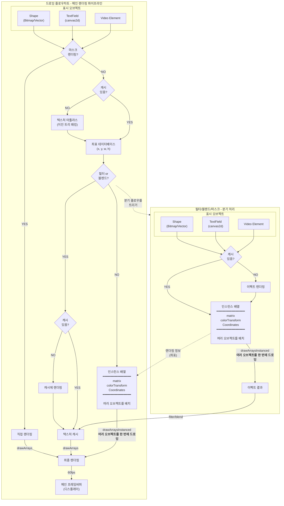

# Next2D Player

Next2D Player는 WebGL/WebGPU를 사용한 고속 2D 렌더링 엔진입니다. Flash Player와 같은 기능을 웹에서 구현하며, 벡터 드로잉, Tween 애니메이션, 텍스트 렌더링 등을 지원합니다.

## 주요 특징

- **고속 렌더링**: WebGL/WebGPU를 활용한 고속 2D 드로잉
- **멀티플랫폼**: 데스크톱부터 모바일까지 지원
- **Flash 호환 API**: swf2js에서 파생된 친숙한 API 설계
- **풍부한 필터**: Blur, DropShadow, Glow, Bevel 등 다수의 필터 지원

## 렌더링 파이프라인

Next2D Player의 고속 렌더링을 실현하는 파이프라인 전체 구조입니다.



### 파이프라인 특징

- **배치 렌더링**: 여러 오브젝트를 한 번의 GPU 호출로 드로잉
- **텍스처 캐시**: 필터나 블렌드 효과를 효율적으로 처리
- **이진 트리 패킹**: 텍스처 아틀라스로 최적의 메모리 사용
- **60fps 드로잉**: 높은 프레임레이트로 부드러운 애니메이션

## DisplayList 아키텍처

Next2D Player는 Flash Player와 동일한 DisplayList 아키텍처를 채택하고 있습니다.

### 주요 클래스 계층

```
DisplayObject (기본 클래스)
├── InteractiveObject
│   ├── DisplayObjectContainer
│   │   ├── Sprite
│   │   ├── MovieClip
│   │   └── Stage
│   └── TextField
├── Shape
├── Video
└── Bitmap
```

### DisplayObjectContainer

자식 오브젝트를 가질 수 있는 컨테이너 클래스:

- `addChild(child)`: 자식 요소를 최전면에 추가
- `addChildAt(child, index)`: 지정 인덱스에 자식 요소 추가
- `removeChild(child)`: 자식 요소 삭제
- `getChildAt(index)`: 인덱스에서 자식 요소 취득
- `getChildByName(name)`: 이름에서 자식 요소 취득

### MovieClip

타임라인 애니메이션을 가진 DisplayObject:

- `play()`: 타임라인 재생
- `stop()`: 타임라인 정지
- `gotoAndPlay(frame)`: 지정 프레임으로 이동 후 재생
- `gotoAndStop(frame)`: 지정 프레임으로 이동 후 정지
- `currentFrame`: 현재 프레임 번호
- `totalFrames`: 총 프레임 수

## 기본 사용법

```typescript
const { MovieClip } = next2d.display;
const { DropShadowFilter } = next2d.filters;

// 루트 MovieClip 생성
const root = await next2d.createRootMovieClip(800, 600, 60, {
    tagId: "container",
    bgColor: "#ffffff"
});

// MovieClip 생성
const mc = new MovieClip();
root.addChild(mc);

// 위치와 크기 설정
mc.x = 100;
mc.y = 100;
mc.scaleX = 2;
mc.scaleY = 2;
mc.rotation = 45;

// 필터 적용
mc.filters = [
    new DropShadowFilter(4, 45, 0x000000, 0.5)
];
```

## JSON 데이터 읽기

Open Animation Tool로 작성한 JSON 파일을 읽어 드로잉:

```typescript
const { Loader } = next2d.display;
const { URLRequest } = next2d.net;

const loader = new Loader();
await loader.load(new URLRequest("animation.json"));

// 읽기 완료 후 직접 content에 접근
const mc = loader.content;
stage.addChild(mc);
```

## 관련 문서

### 표시 오브젝트
- [DisplayObject](/ko/reference/player/display-object) - 모든 표시 오브젝트의 기본 클래스
- [MovieClip](/ko/reference/player/movie-clip) - 타임라인 애니메이션
- [Sprite](/ko/reference/player/sprite) - 그래픽스 드로잉과 인터랙션
- [Shape](/ko/reference/player/shape) - 경량 벡터 드로잉
- [TextField](/ko/reference/player/text-field) - 텍스트 표시와 입력
- [Video](/ko/reference/player/video) - 동영상 재생

### 시스템
- [이벤트 시스템](/ko/reference/player/events) - 마우스, 키보드, 터치 이벤트
- [필터](/ko/reference/player/filters) - Blur, DropShadow, Glow 등
- [사운드](/ko/reference/player/sound) - 음성 재생과 사운드 이펙트
- [Tween 애니메이션](/ko/reference/player/tween) - 프로그램으로 만드는 애니메이션
