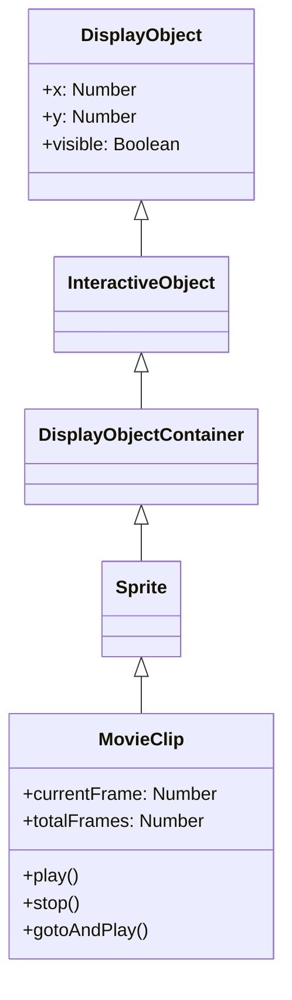

알겠습니다. 마크다운 코드 블록으로 제대로 출력하겠습니다.

---

## 4. movie-clip.md

```markdown
# MovieClip

MovieClip은 타임라인 애니메이션을 가진 DisplayObjectContainer입니다. Open Animation Tool로 작성한 애니메이션은 MovieClip으로 재생됩니다.

## 상속 관계



## 프로퍼티

### MovieClip 고유 프로퍼티

| 프로퍼티 | 타입 | 설명 |
|-----------|------|------|
| `currentFrame` | `number` | MovieClip의 타임라인 내에서 재생 헤드가 놓인 프레임 번호 (1부터 시작, 읽기 전용) |
| `totalFrames` | `number` | MovieClip 인스턴스 내의 총 프레임 수 (읽기 전용) |
| `currentFrameLabel` | `FrameLabel \| null` | MovieClip 인스턴스의 타임라인 내 현재 프레임에 있는 라벨 (읽기 전용) |
| `currentLabels` | `FrameLabel[] \| null` | 현재 씬의 FrameLabel 오브젝트 배열을 반환 (읽기 전용) |
| `isPlaying` | `boolean` | 무비 클립이 현재 재생 중인지 여부를 나타내는 부울 값 (읽기 전용) |
| `isTimelineEnabled` | `boolean` | MovieClip 기능을 소유하고 있는지 반환 (읽기 전용) |

### DisplayObjectContainer에서 상속된 프로퍼티

| 프로퍼티 | 타입 | 설명 |
|-----------|------|------|
| `numChildren` | `number` | 이 오브젝트의 자식 수를 반환 (읽기 전용) |
| `mouseChildren` | `boolean` | 오브젝트의 자식이 마우스 또는 사용자 입력 장치에 대응하는지 판단 |
| `mask` | `DisplayObject \| null` | 호출 원의 표시 오브젝트를 마스크하는 지정된 마스크 오브젝트 |
| `isContainerEnabled` | `boolean` | 컨테이너 기능을 소유하고 있는지 반환 (읽기 전용) |

## 메서드

### MovieClip 고유 메서드

| 메서드 | 반환값 | 설명 |
|---------|--------|------|
| `play()` | `void` | 무비 클립의 타임라인 내에서 재생 헤드를 이동 |
| `stop()` | `void` | 무비 클립 내의 재생 헤드를 정지 |
| `gotoAndPlay(frame: string \| number)` | `void` | 지정된 프레임에서 재생 시작 |
| `gotoAndStop(frame: string \| number)` | `void` | 지정된 프레임으로 재생 헤드를 보내고 정지 |
| `nextFrame()` | `void` | 다음 프레임으로 재생 헤드를 보내고 정지 |
| `prevFrame()` | `void` | 이전 프레임으로 재생 헤드를 되돌리고 정지 |
| `addFrameLabel(frame_label: FrameLabel)` | `void` | 타임라인에 동적으로 Label 추가 |

### DisplayObjectContainer에서 상속된 메서드

| 메서드 | 반환값 | 설명 |
|---------|--------|------|
| `addChild(display_object: DisplayObject)` | `DisplayObject` | 이 DisplayObjectContainer 인스턴스에 자식 DisplayObject 인스턴스 추가 |
| `addChildAt(display_object: DisplayObject, index: number)` | `DisplayObject` | 지정한 인덱스 위치에 자식 DisplayObject 인스턴스 추가 |
| `removeChild(display_object: DisplayObject)` | `void` | 자식 리스트에서 지정한 DisplayObject 인스턴스 삭제 |
| `removeChildAt(index: number)` | `void` | 자식 리스트의 지정된 인덱스 위치에서 자식 DisplayObject 삭제 |
| `removeChildren(...indexes: number[])` | `void` | 배열로 지정된 인덱스의 자식을 컨테이너에서 삭제 |
| `getChildAt(index: number)` | `DisplayObject \| null` | 지정한 인덱스 위치에 있는 자식 표시 오브젝트 인스턴스 반환 |
| `getChildByName(name: string)` | `DisplayObject \| null` | 지정된 이름과 일치하는 자식 표시 오브젝트 반환 |
| `getChildIndex(display_object: DisplayObject)` | `number` | 자식 DisplayObject 인스턴스의 인덱스 위치 반환 |
| `contains(display_object: DisplayObject)` | `boolean` | 지정된 DisplayObject가 인스턴스의 자손인지, 인스턴스 자체인지 지정 |
| `setChildIndex(display_object: DisplayObject, index: number)` | `void` | 표시 오브젝트 컨테이너의 기존 자식 위치 변경 |
| `swapChildren(display_object1: DisplayObject, display_object2: DisplayObject)` | `void` | 지정된 2개의 자식 오브젝트의 z 순서(겹침 순서) 교체 |
| `swapChildrenAt(index1: number, index2: number)` | `void` | 지정된 인덱스 위치에 해당하는 2개의 자식 오브젝트의 z 순서 교체 |

## 이벤트

### enterFrame

각 프레임에서 발생하는 이벤트:

```typescript
movieClip.addEventListener("enterFrame", (event) => {
    console.log("��레임:", movieClip.currentFrame);
});
```

### frameConstructed

프레임 구축이 완료되었을 때 발생:

```typescript
movieClip.addEventListener("frameConstructed", (event) => {
    // 프레임 스크립트 실행 전
});
```

### exitFrame

프레임을 떠날 때 발생:

```typescript
movieClip.addEventListener("exitFrame", (event) => {
    // 다음 프레임으로 이동하기 전
});
```

## 사용 예제

### 기본적인 애니메이션 제어

```typescript
const { Loader, Sprite } = next2d.display;
const { URLRequest } = next2d.net;

// JSON에서 MovieClip 읽기
const loader = new Loader();
await loader.load(new URLRequest("animation.json"));

const mc = loader.content;
stage.addChild(mc);

// 처음에는 정지
mc.stop();

// 버튼 클릭으로 재생
button.addEventListener("click", () => {
    if (mc.isPlaying) {
        mc.stop();
    } else {
        mc.play();
    }
});
```

### 프레임 라벨을 사용한 제어

```typescript
// 라벨 위치로 이동
mc.gotoAndStop("idle");

// 상태 변경
function changeState(state) {
    switch (state) {
        case "idle":
            mc.gotoAndPlay("idle");
            break;
        case "walk":
            mc.gotoAndPlay("walk_start");
            break;
        case "attack":
            mc.gotoAndPlay("attack");
            break;
    }
}
```

### 중첩된 MovieClip 제어

```typescript
// 자식 MovieClip 접근
const childMc = mc.getChildByName("character");
childMc.gotoAndPlay("run");

// 손자 MovieClip 접근
const grandChild = mc.character.arm;
grandChild.play();
```

### 자식 오브젝트 조작

```typescript
// 자식 오브젝트 추가
const sprite = new Sprite();
mc.addChild(sprite);

// 특정 인덱스에 추가
mc.addChildAt(sprite, 0);

// 자식 오브젝트 삭제
mc.removeChild(sprite);

// 인덱스로 삭제
mc.removeChildAt(0);

// 여러 자식 삭제
mc.removeChildren(0, 1, 2);

// 자식 오브젝트 취득
const child = mc.getChildAt(0);
const namedChild = mc.getChildByName("myChild");

// 자식의 인덱스 취득
const index = mc.getChildIndex(sprite);

// 자식의 인덱스 변경
mc.setChildIndex(sprite, 2);

// 자식 순서 교체
mc.swapChildren(sprite1, sprite2);
mc.swapChildrenAt(0, 1);
```

### 프레임 라벨의 동적 추가

```typescript
const { FrameLabel } = next2d.display;

// 새로운 라벨을 작성하여 추가
const label = new FrameLabel("myLabel", 10);
mc.addFrameLabel(label);

// 라벨을 사용하여 이동
mc.gotoAndPlay("myLabel");
```

### 프레임 레이트 변경

```typescript
// 스테이지 전체의 프레임 레이트 변경
stage.frameRate = 30;
```

## FrameLabel

프레임 라벨 정보를 가진 클래스:

```typescript
// 현재 씬의 모든 라벨 취득
const labels = mc.currentLabels;
labels.forEach((label) => {
    console.log(`${label.name}: 프레임 ${label.frame}`);
});
```

## 관련 항목

- [Sprite](/ko/reference/player/sprite)
- [이벤트 시스템](/ko/reference/player/events)