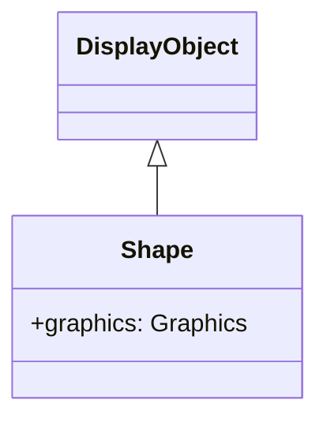

# Shape

Shape는 벡터 그래픽스 드로잉 전용 클래스입니다. Sprite와 다르게 자식 오브젝트를 가질 수 없지만, 경량이며 성능이 우수합니다.

## 상속 관계



## 프로퍼티

| 프로퍼티 | 타입 | 설명 |
|-----------|------|------|
| `graphics` | Graphics | 이 Shape 오브젝트에 그려지는 벡터의 드로잉 명령을 보유하는 Graphics 오브젝트 (읽기 전용) |
| `isShape` | boolean | Shape 기능을 소유하고 있는지 반환 (읽기 전용) |
| `cacheKey` | number | 빌드된 캐시 키 |
| `cacheParams` | number[] | 캐시 빌드에 사용되는 파라미터 (읽기 전용) |
| `isBitmap` | boolean | 비트맵 드로잉 판정 플래그 |
| `src` | string | 지정된 경로에서 이미지를 읽고 Graphics 생성 |
| `bitmapData` | BitmapData | 비트맵 데이터 반환 (읽기 전용) |
| `namespace` | string | 지정된 오브젝트의 공간명 반환 (읽기 전용) |

## 메서드

| 메서드 | 반환값 | 설명 |
|---------|--------|------|
| `load(url: string)` | Promise\<void\> | 지정된 URL에서 이미지를 비동기로 읽고 Graphics 생성 |
| `clearBitmapBuffer()` | void | 비트맵 데이터 해제 |
| `setBitmapBuffer(width: number, height: number, buffer: Uint8Array)` | void | RGBA 이미지 데이터 설정 |

## Sprite와 Shape의 차이

| 특징 | Shape | Sprite |
|------|-------|--------|
| 자식 오브젝트 | 가질 수 없음 | 가질 수 있음 |
| 인터랙션 | 없음 | 클릭 등 가능 |
| 성능 | 경량 | 약간 무거움 |
| 용도 | 정적 배경, 장식 | 버튼, 컨테이너 |

## 사용 예제

### 기본적인 드로잉

```typescript
const { Shape } = next2d.display;

const shape = new Shape();

// 채우기 사각형
shape.graphics.beginFill(0x3498db);
shape.graphics.drawRect(0, 0, 150, 100);
shape.graphics.endFill();

stage.addChild(shape);
```

### 복합 도형 드로잉

```typescript
const { Shape } = next2d.display;

const shape = new Shape();
const g = shape.graphics;

// 배경
g.beginFill(0xecf0f1);
g.drawRoundRect(0, 0, 200, 150, 10, 10);
g.endFill();

// 테두리
g.lineStyle(2, 0x2c3e50);
g.drawRoundRect(0, 0, 200, 150, 10, 10);

// 내부 장식
g.beginFill(0xe74c3c);
g.drawCircle(100, 75, 30);
g.endFill();

stage.addChild(shape);
```

### 패스 드로잉

```typescript
const { Shape } = next2d.display;

const shape = new Shape();
const g = shape.graphics;

g.beginFill(0x9b59b6);

// 별 모양 그리기
g.moveTo(50, 0);
g.lineTo(61, 35);
g.lineTo(98, 35);
g.lineTo(68, 57);
g.lineTo(79, 91);
g.lineTo(50, 70);
g.lineTo(21, 91);
g.lineTo(32, 57);
g.lineTo(2, 35);
g.lineTo(39, 35);
g.lineTo(50, 0);

g.endFill();

stage.addChild(shape);
```

### 베지어 곡선

```typescript
const { Shape } = next2d.display;

const shape = new Shape();
const g = shape.graphics;

g.lineStyle(3, 0x1abc9c);

// 2차 베지어 곡선
g.moveTo(0, 100);
g.curveTo(50, 0, 100, 100);  // 제어점, 종점

g.curveTo(150, 200, 200, 100);

stage.addChild(shape);
```

### 그라디언트 배경

```typescript
const { Shape } = next2d.display;
const { Matrix } = next2d.geom;

const shape = new Shape();
const g = shape.graphics;

// 그라디언트용 매트릭스
const matrix = new Matrix();
matrix.createGradientBox(
    stage.stageWidth,
    stage.stageHeight,
    Math.PI / 2,  // 90도 (세로 방향)
    0, 0
);

// 방사상 그라��언트
g.beginGradientFill(
    "radial",
    [0x667eea, 0x764ba2],
    [1, 1],
    [0, 255],
    matrix
);
g.drawRect(0, 0, stage.stageWidth, stage.stageHeight);
g.endFill();

// 최배면에 배치
stage.addChildAt(shape, 0);
```

### 동적 재드로잉

```typescript
const { Shape } = next2d.display;

const shape = new Shape();
stage.addChild(shape);

let angle = 0;

// 프레임마다 재드로잉
stage.addEventListener("enterFrame", () => {
    const g = shape.graphics;

    // 이전 드로잉 클리어
    g.clear();

    // 새 위치에 드로잉
    const x = 200 + Math.cos(angle) * 100;
    const y = 150 + Math.sin(angle) * 100;

    g.beginFill(0xe74c3c);
    g.drawCircle(x, y, 20);
    g.endFill();

    angle += 0.05;
});
```

### 여러 Shape로 구성

```typescript
const { Shape } = next2d.display;

// 배경 레이어
const bgShape = new Shape();
bgShape.graphics.beginFill(0x2c3e50);
bgShape.graphics.drawRect(0, 0, 400, 300);
bgShape.graphics.endFill();

// 장식 레이어
const decorShape = new Shape();
decorShape.graphics.beginFill(0x3498db, 0.5);
decorShape.graphics.drawCircle(100, 100, 80);
decorShape.graphics.drawCircle(300, 200, 60);
decorShape.graphics.endFill();

// 전면 레이어
const frontShape = new Shape();
frontShape.graphics.lineStyle(2, 0xecf0f1);
frontShape.graphics.drawRect(50, 50, 300, 200);

stage.addChild(bgShape);
stage.addChild(decorShape);
stage.addChild(frontShape);
```

## 성능 힌트

1. **정적 드로잉에는 Shape 사용**: 인터랙션이 불필요한 배경이나 장식에는 Shape가 최적
2. **드로잉 최소화**: 자주 변경되지 않는 경우 한 번만 드로잉
3. **clear() 사용**: 동적 재드로잉 시 반드시 clear() 호출
4. **복잡한 도형은 캐시**: cacheAsBitmap 프로퍼티로 드로잉 캐시

```typescript
// 복잡한 도형을 비트맵으로 캐시
shape.cacheAsBitmap = true;
```

## Graphics 클래스

Graphics 클래스는 벡터 그래픽스 드로잉을 위한 드로잉 API를 제공합니다. Shape.graphics 프로퍼티를 통해 접근합니다.

### 채우기 메서드

| 메서드 | 설명 |
|---------|------|
| `beginFill(color: number, alpha?: number)` | 단색 채우기 시작. alpha 기본값은 1 |
| `beginGradientFill(type, colors, alphas, ratios, matrix?, spreadMethod?, interpolationMethod?, focalPointRatio?)` | 그라디언트 채우기 시작 |
| `beginBitmapFill(bitmapData, matrix?, repeat?, smooth?)` | 비트맵 채우기 시작 |
| `endFill()` | 채우기 종료 |

#### beginGradientFill 파라미터

| 파라미터 | 타입 | 설명 |
|-----------|------|------|
| `type` | string | "linear" 또는 "radial" |
| `colors` | number[] | 색상 배열 (16진수) |
| `alphas` | number[] | 각 색상의 투명도 (0-1) |
| `ratios` | number[] | 각 색상의 위치 (0-255) |
| `matrix` | Matrix | 그라디언트 변형 매트릭스 |
| `spreadMethod` | string | "pad", "reflect", "repeat" (기본값: "pad") |
| `interpolationMethod` | string | "rgb" 또는 "linearRGB" (기본값: "rgb") |
| `focalPointRatio` | number | 방사상 그라디언트의 초점 위치 (-1 to 1) |

### 선 스타일 메서드

| 메서드 | 설명 |
|---------|------|
| `lineStyle(thickness?, color?, alpha?, pixelHinting?, scaleMode?, caps?, joints?, miterLimit?)` | 선 스타일 설정 |
| `lineGradientStyle(type, colors, alphas, ratios, matrix?, spreadMethod?, interpolationMethod?, focalPointRatio?)` | 그라디언트 선 스타일 설정 |
| `lineBitmapStyle(bitmapData, matrix?, repeat?, smooth?)` | 비트맵 선 스타일 설정 |
| `endLine()` | 선 스타일 종료 |

#### lineStyle 파라미터

| 파라미터 | 타입 | 기본값 | 설명 |
|-----------|------|---------|------|
| `thickness` | number | 0 | 선 두께 (픽셀) |
| `color` | number | 0 | 선 색상 (16진수) |
| `alpha` | number | 1 | 투명도 (0-1) |
| `pixelHinting` | boolean | false | 픽셀 스냅 |
| `scaleMode` | string | "normal" | "normal", "none", "vertical", "horizontal" |
| `caps` | string | null | "none", "round", "square" |
| `joints` | string | null | "bevel", "miter", "round" |
| `miterLimit` | number | 3 | 마이터 결합 한계값 |

### 패스 메서드

| 메서드 | 설명 |
|---------|------|
| `moveTo(x: number, y: number)` | 드로잉 위치 이동 |
| `lineTo(x: number, y: number)` | 현재 위치에서 지정 좌표까지 직선 그리기 |
| `curveTo(controlX, controlY, anchorX, anchorY)` | 2차 베지어 곡선 그리기 |
| `cubicCurveTo(controlX1, controlY1, controlX2, controlY2, anchorX, anchorY)` | 3차 베지어 곡선 그리기 |

### 도형 메서드

| 메서드 | 설명 |
|---------|------|
| `drawRect(x, y, width, height)` | 사각형 그리기 |
| `drawRoundRect(x, y, width, height, ellipseWidth, ellipseHeight?)` | 둥근 모서리 사각형 그리기 |
| `drawCircle(x, y, radius)` | 원 그리기 |
| `drawEllipse(x, y, width, height)` | 타원 그리기 |

### 유틸리티 메서드

| 메서드 | 설명 |
|---------|------|
| `clear()` | 모든 드로잉 명령 클리어 |
| `clone()` | Graphics 오브젝트 복제 |
| `copyFrom(source: Graphics)` | 다른 Graphics에서 드로잉 명령 복사 |

## 관련 항목

- [DisplayObject](/ko/reference/player/display-object)
- [Sprite](/ko/reference/player/sprite)
- [필터](/ko/reference/player/filters)