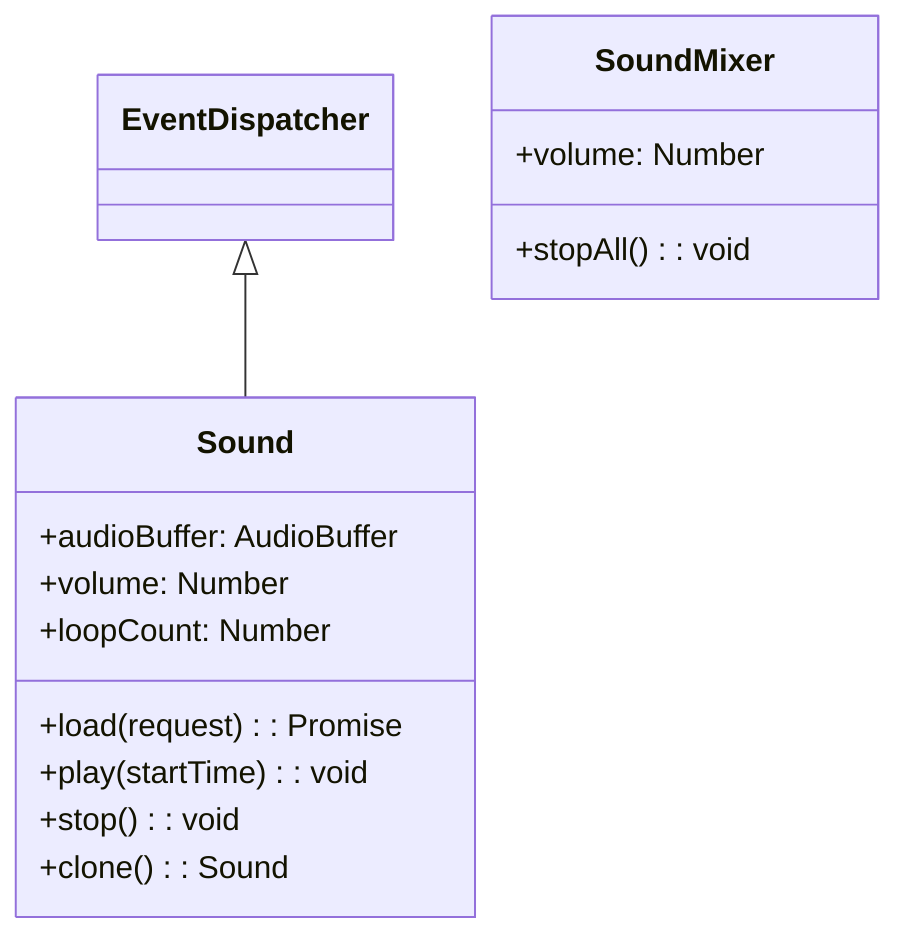

# 사운드

Next2D Player는 게임이나 애플리케이션에서 필요한 음성 기능을 제공합니다. BGM, 효과음, 보이스 등 다양한 용도에 대응합니다.

## 클래스 구성



## Sound

음성 파일을 읽고 재생하는 클래스입니다. EventDispatcher를 상속합니다.

### 프로퍼티

| 프로퍼티 | 타입 | 기본값 | 읽기 전용 | 설명 |
|-----------|------|----------|:------------:|------|
| `audioBuffer` | AudioBuffer \| null | null | - | 오디오 버퍼. load()로 읽은 음성 데이터가 저장됩니다 |
| `loopCount` | number | 0 | - | 루프 횟수 설정. 0으로 루프 없음, 9999로 사실상 무한 루프 |
| `volume` | number | 1 | - | 볼륨. 범위는 0(무음)~1(풀 볼륨). SoundMixer.volume 값을 초과할 수 없습니다 |
| `canLoop` | boolean | - | ○ | 사운드가 루프하는지 여부를 나타냅니다 |

### 메서드

| 메서드 | 반환값 | 설명 |
|---------|--------|------|
| `clone()` | Sound | Sound 클래스를 복제합니다. volume, loopCount, audioBuffer가 복사됩니다 |
| `load(request: URLRequest)` | Promise\<void\> | 지정한 URL에서 외부 MP3 파일 로드를 시작합니다 |
| `play(startTime: number = 0)` | void | 사운드를 재생합니다. startTime은 재생 시작 시간(초 단위)입니다. 이미 재생 중인 경우 아무것도 하지 않습니다 |
| `stop()` | void | 채널에서 재생하는 사운드를 정지합니다 |

## 사용 예제

### 기본적인 음성 재생

```typescript
const { Sound } = next2d.media;
const { URLRequest } = next2d.net;

// Sound 오브젝트 생성
const sound = new Sound();

// 음성 파일을 비동기로 읽기
const request = new URLRequest("bgm.mp3");
await sound.load(request);

// 재생 시작
sound.play();
```

### 효과음 재생

```typescript
const { Sound } = next2d.media;
const { URLRequest } = next2d.net;

// 효과음 프리로드
const seJump = new Sound();
const seHit = new Sound();
const seCoin = new Sound();

// 읽기
await seJump.load(new URLRequest("se/jump.mp3"));
await seHit.load(new URLRequest("se/hit.mp3"));
await seCoin.load(new URLRequest("se/coin.mp3"));

// 재생 함수
function playSE(sound) {
    // 복제하여 재생 (동시에 여러 번 재생하는 경우)
    const clone = sound.clone();
    clone.play();
}

// 게임 중에 사용
player.addEventListener("jump", () => {
    playSE(seJump);
});
```

### BGM 루프 재생

```typescript
const { Sound } = next2d.media;
const { URLRequest } = next2d.net;

const bgm = new Sound();

// 읽기
await bgm.load(new URLRequest("bgm/stage1.mp3"));

// 음량 설정
bgm.volume = 0.7;  // 70%

// 루프 횟수 설정 (9999로 사실상 무한 루프)
bgm.loopCount = 9999;

// 재생
bgm.play();

// BGM 정지
function stopBGM() {
    bgm.stop();
}
```

### 음량 컨트롤

```typescript
const { Sound } = next2d.media;
const { URLRequest } = next2d.net;

const bgm = new Sound();
await bgm.load(new URLRequest("bgm.mp3"));

// 음량 설정
bgm.volume = 1.0;
bgm.play();

// 음량 변경
function setVolume(volume) {
    bgm.volume = Math.max(0, Math.min(1, volume));
}

// 페이드 아웃
async function fadeOut(duration = 1000) {
    const startVolume = bgm.volume;
    const startTime = Date.now();

    return new Promise((resolve) => {
        const fade = () => {
            const elapsed = Date.now() - startTime;
            const progress = Math.min(1, elapsed / duration);

            bgm.volume = startVolume * (1 - progress);

            if (progress >= 1) {
                bgm.stop();
                resolve();
            } else {
                requestAnimationFrame(fade);
            }
        };
        fade();
    });
}
```

### 사운드 매니저

```typescript
const { Sound, SoundMixer } = next2d.media;
const { URLRequest } = next2d.net;

class SoundManager {
    constructor() {
        this._sounds = new Map();
        this._bgm = null;
        this._bgmVolume = 0.7;
        this._seVolume = 1.0;
        this._isMuted = false;
    }

    // 사운드 프리로드
    async preload(id, url) {
        const sound = new Sound();
        await sound.load(new URLRequest(url));
        this._sounds.set(id, sound);
    }

    // BGM 재생
    playBGM(id, loops = 9999) {
        this.stopBGM();

        const sound = this._sounds.get(id);
        if (sound) {
            this._bgm = sound.clone();
            this._bgm.volume = this._isMuted ? 0 : this._bgmVolume;
            this._bgm.loopCount = loops;
            this._bgm.play();
        }
    }

    // BGM 정지
    stopBGM() {
        if (this._bgm) {
            this._bgm.stop();
            this._bgm = null;
        }
    }

    // SE 재생
    playSE(id) {
        const sound = this._sounds.get(id);
        if (sound) {
            const clone = sound.clone();
            clone.volume = this._isMuted ? 0 : this._seVolume;
            clone.play();
        }
    }

    // 뮤트 전환
    toggleMute() {
        this._isMuted = !this._isMuted;
        if (this._bgm) {
            this._bgm.volume = this._isMuted ? 0 : this._bgmVolume;
        }
        return this._isMuted;
    }

    // BGM 음량 설정
    setBGMVolume(volume) {
        this._bgmVolume = Math.max(0, Math.min(1, volume));
        if (this._bgm && !this._isMuted) {
            this._bgm.volume = this._bgmVolume;
        }
    }

    // SE 음량 설정
    setSEVolume(volume) {
        this._seVolume = Math.max(0, Math.min(1, volume));
    }
}

// 사용 예제
const soundManager = new SoundManager();

// 기동 시 프리로드
async function initSounds() {
    await soundManager.preload("bgm_title", "bgm/title.mp3");
    await soundManager.preload("bgm_stage1", "bgm/stage1.mp3");
    await soundManager.preload("se_jump", "se/jump.mp3");
    await soundManager.preload("se_coin", "se/coin.mp3");
    await soundManager.preload("se_damage", "se/damage.mp3");
}

// 게임 중
soundManager.playBGM("bgm_stage1");
soundManager.playSE("se_jump");
```

## SoundMixer

전체 사운드를 제어하는 클래스입니다.

```typescript
const { SoundMixer } = next2d.media;

// 모든 음성 정지
SoundMixer.stopAll();

// 전체 음량 변경
SoundMixer.volume = 0.5;  // 50%
```

## 지원 포맷

| 포맷 | 확장자 | 대응 상황 |
|--------------|--------|----------|
| MP3 | .mp3 | 권장 |
| AAC | .m4a, .aac | 대응 |
| Ogg Vorbis | .ogg | 브라우저 의존 |
| WAV | .wav | 대응 (파일 크기 큼) |

## 베스트 프랙티스

1. **프리로드**: 게임 시작 전에 모든 음성을 프리로드
2. **포맷**: MP3 권장 (호환성과 압축률의 균형)
3. **효과음**: 짧은 음성은 WAV도 가능 (레이턴시가 낮음)
4. **음량 관리**: BGM과 SE의 음량을 별도로 관리
5. **모바일 대응**: 사용자 인터랙션 후에 재생 시작
6. **clone 사용**: 같은 소리를 동시에 여러 번 재생하는 경우 clone() 사용

## 관련 항목

- [이벤트 시스템](/ja/reference/player/events)
