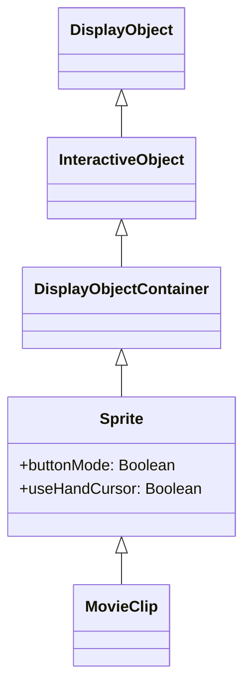

# Sprite

Sprite는 DisplayObjectContainer입니다. MovieClip의 기본 클래스이며, 타임라인을 가지지 않는 동적 오브젝트 관리에 사용합니다.

## 상속 관계



## 프로퍼티

### Sprite 고유 프로퍼티

| 프로퍼티 | 타입 | 읽기 전용 | 기본값 | 설명 |
|-----------|------|:--------:|------------|------|
| `isSprite` | boolean | Yes | true | Sprite 기능을 소유하고 있는지 반환 |
| `buttonMode` | boolean | No | false | 이 스프라이트의 버튼 모드를 지정합니다 |
| `useHandCursor` | boolean | No | true | buttonMode가 true인 경우 핸드 커서를 표시할지 여부 |
| `hitArea` | Sprite \| null | No | null | 스프라이트의 히트 영역이 되는 다른 스프라이트를 지정합니다 |
| `soundTransform` | SoundTransform \| null | No | null | 이 스프라이트 내의 사운드를 제어합니다 |

### DisplayObjectContainer에서 상속된 프로퍼티

| 프로퍼티 | 타입 | 읽기 전용 | 기본값 | 설명 |
|-----------|------|:--------:|------------|------|
| `isContainerEnabled` | boolean | Yes | true | 컨테이너 기능을 소유하고 있는지 반환 |
| `mouseChildren` | boolean | No | true | 오브젝트의 자식이 마우스 또는 사용자 입력 장치에 대응하는지 여부 |
| `numChildren` | number | Yes | - | 이 오브젝트의 자식 수를 반환합니다 |
| `mask` | DisplayObject \| null | No | null | 표시 오브젝트를 마스크합니다 |

### InteractiveObject에서 상속된 프로퍼티

| 프로퍼티 | 타입 | 읽기 전용 | 기본값 | 설명 |
|-----------|------|:--------:|------------|------|
| `isInteractive` | boolean | Yes | true | InteractiveObject 기능을 소유하고 있는지 반환 |
| `mouseEnabled` | boolean | No | true | 이 오브젝트에서 마우스 또는 다른 사용자 입력 메시지를 받을지 여부 |

### DisplayObject에서 상속된 프로퍼티

| 프로퍼티 | 타입 | 읽기 전용 | 기본값 | 설명 |
|-----------|------|:--------:|------------|------|
| `instanceId` | number | Yes | - | DisplayObject의 고유 인스턴스 ID |
| `name` | string | No | "" | 이름을 반환합니다. getChildByName()에서 사용됩니다 |
| `parent` | Sprite \| MovieClip \| null | No | null | 이 DisplayObject의 부모 DisplayObjectContainer를 반환 |
| `x` | number | No | 0 | 부모 DisplayObjectContainer의 로컬 좌표를 기준으로 한 x 좌표 |
| `y` | number | No | 0 | 부모 DisplayObjectContainer의 로컬 좌표를 기준으로 한 y 좌표 |
| `width` | number | No | - | 표시 오브젝트의 너비 (픽셀 단위) |
| `height` | number | No | - | 표시 오브젝트의 높이 (픽셀 단위) |
| `scaleX` | number | No | 1 | 기준점에서 적용되는 오브젝트의 수평 스케일 값 |
| `scaleY` | number | No | 1 | 기준점에서 적용되는 오브젝트의 수직 스케일 값 |
| `rotation` | number | No | 0 | DisplayObject 인스턴스의 원래 위치에서의 회전 각도 (도 단위) |
| `alpha` | number | No | 1 | 지정된 오브젝트의 알파 투명도 값 (0.0~1.0) |
| `visible` | boolean | No | true | 표시 오브젝트가 가시적인지 여부 |
| `blendMode` | string | No | "normal" | 사용할 블렌드 모드를 지정하는 BlendMode 클래스의 값 |
| `filters` | array \| null | No | null | 표시 오브젝트에 연결된 각 필터 오브젝트의 배열 |
| `matrix` | Matrix | No | - | 표시 오브젝트의 Matrix를 반환합니다 |
| `colorTransform` | ColorTransform | No | - | 표시 오브젝트의 ColorTransform을 반환합니다 |
| `concatenatedMatrix` | Matrix | Yes | - | 이 표시 오브젝트와 모든 부모 오브젝트의 결합된 Matrix |
| `scale9Grid` | Rectangle \| null | No | null | 현재 유효한 확대/축소 그리드 |
| `loaderInfo` | LoaderInfo \| null | Yes | null | 이 표시 오브젝트가 속한 파일의 로딩 정보 |
| `root` | MovieClip \| Sprite \| null | Yes | null | DisplayObject의 루트인 DisplayObjectContainer |
| `mouseX` | number | Yes | - | 대상 DisplayObject의 기준점에서 x 축 위치 (픽셀) |
| `mouseY` | number | Yes | - | 대상 DisplayObject의 기준점에서 y 축 위치 (픽셀) |
| `dropTarget` | Sprite \| null | Yes | null | 스프라이트의 드래그 대상 또는 드롭된 표시 오브젝트 |
| `isMask` | boolean | No | false | 마스크로 DisplayObject에 설정되어 있는지 나타냅니다 |

## 메서드

### Sprite 고유 메서드

| 메서드 | 반환값 | 설명 |
|---------|--------|------|
| `startDrag(lockCenter?: boolean, bounds?: Rectangle)` | void | 지정된 스프라이트를 사용자가 드래그할 수 있게 합니다 |
| `stopDrag()` | void | startDrag() 메서드를 종료합니다 |

### DisplayObjectContainer에서 상속된 메서드

| 메서드 | 반환값 | 설명 |
|---------|--------|------|
| `addChild(child: DisplayObject)` | DisplayObject | 자식 DisplayObject 인스턴스를 추가합니다 |
| `addChildAt(child: DisplayObject, index: number)` | DisplayObject | 지정한 인덱스 위치에 자식 DisplayObject 인스턴스를 추가합니다 |
| `removeChild(child: DisplayObject)` | void | 지정한 child DisplayObject 인스턴스를 삭제합니다 |
| `removeChildAt(index: number)` | void | 지정한 인덱스 위치에서 자식 DisplayObject를 삭제합니다 |
| `removeChildren(...indexes: number[])` | void | 배열로 지정된 인덱스의 자식을 컨테이너에서 삭제합니다 |
| `getChildAt(index: number)` | DisplayObject \| null | 지정한 인덱스 위치에 있는 자식 표시 오브젝트 인스턴스를 반환합니다 |
| `getChildByName(name: string)` | DisplayObject \| null | 지정된 이름과 일치하는 자식 표시 오브젝트를 반환합니다 |
| `getChildIndex(child: DisplayObject)` | number | 자식 DisplayObject 인스턴스의 인덱스 위치를 반환합니다 |
| `setChildIndex(child: DisplayObject, index: number)` | void | 표시 오브젝트 컨테이너의 기존 자식 위치를 변경합니다 |
| `contains(child: DisplayObject)` | boolean | 지정된 DisplayObject가 인스턴스의 자손인지 여부 |
| `swapChildren(child1: DisplayObject, child2: DisplayObject)` | void | 지정된 2개의 자식 오브젝트의 z 순서를 교체합니다 |
| `swapChildrenAt(index1: number, index2: number)` | void | 지정된 인덱스 위치의 2개의 자식 오브젝트의 z 순서를 교체합니다 |

### DisplayObject에서 상속된 메서드

| 메서드 | 반환값 | 설명 |
|---------|--------|------|
| `getBounds(targetDisplayObject?: DisplayObject)` | Rectangle | 지정한 DisplayObject의 좌표계를 기준으로 표시 오브젝트의 영역을 정의하는 사각형을 반환합니다 |
| `globalToLocal(point: Point)` | Point | point 오브젝트를 스테이지(글로벌) 좌표에서 표시 오브젝트의(로컬) 좌표로 변환합니다 |
| `localToGlobal(point: Point)` | Point | point 오브젝트를 표시 오브젝트의(로컬) 좌표에서 스테이지(글로벌) 좌표로 변환합니다 |
| `hitTestObject(target: DisplayObject)` | boolean | DisplayObject의 드로잉 범위를 평가하여 중복 또는 교차 여부를 조사합니다 |
| `hitTestPoint(x: number, y: number, shapeFlag?: boolean)` | boolean | 표시 오브젝트를 평가하여 x, y 파라미터로 지정된 포인트와 중복 또는 교차 여부를 조사합니다 |
| `remove()` | void | 부모-자식 관계를 해제합니다 |
| `getLocalVariable(key: any)` | any | 클래스의 로컬 변수 공간에서 값 취득 |
| `setLocalVariable(key: any, value: any)` | void | 클래스의 로컬 변수 공간에 값 저장 |
| `hasLocalVariable(key: any)` | boolean | 클래스의 로컬 변수 공간에 값이 있는지 판단합니다 |
| `deleteLocalVariable(key: any)` | void | 클래스의 로컬 변수 공간의 값 삭제 |
| `getGlobalVariable(key: any)` | any | 글로벌 변수 공간에서 값 취득 |
| `setGlobalVariable(key: any, value: any)` | void | 글로벌 변수 공간에 값 저장 |
| `hasGlobalVariable(key: any)` | boolean | 글로벌 변수 공간에 값이 있는지 판단합니다 |
| `deleteGlobalVariable(key: any)` | void | 글로벌 변수 공간의 값 삭제 |
| `clearGlobalVariable()` | void | 글로벌 변수 공간에 값을 모두 클리어합니다 |

## 사용 예제

### 버튼으로 사용

```typescript
const { Sprite, Shape } = next2d.display;

const button = new Sprite();

// 버튼 모드 활성화
button.buttonMode = true;
button.useHandCursor = true;

// 배경용 Shape 생성
const bg = new Shape();
bg.graphics.beginFill(0x3498db);
bg.graphics.drawRoundRect(0, 0, 120, 40, 8, 8);
bg.graphics.endFill();
button.addChild(bg);

// 클릭 이벤트
button.addEventListener("click", () => {
    console.log("버튼이 클릭되었습니다");
});

stage.addChild(button);
```

### 마스크로 사용

```typescript
const { Sprite, Shape } = next2d.display;

const container = new Sprite();

// 콘텐츠용 Shape
const content = new Shape();
content.graphics.beginFill(0xFF0000);
content.graphics.drawRect(0, 0, 200, 200);
content.graphics.endFill();
container.addChild(content);

// 마스크용 Shape
const maskShape = new Shape();
maskShape.graphics.beginFill(0xFFFFFF);
maskShape.graphics.drawCircle(100, 100, 50);
maskShape.graphics.endFill();

// 마스크 적용
container.mask = maskShape;

stage.addChild(container);
stage.addChild(maskShape);
```

### 드래그 앤 드롭

```typescript
const { Sprite, Shape } = next2d.display;
const { Rectangle } = next2d.geom;

const draggable = new Sprite();

// 배경용 Shape 생성
const bg = new Shape();
bg.graphics.beginFill(0x3498db);
bg.graphics.drawRect(0, 0, 100, 100);
bg.graphics.endFill();
draggable.addChild(bg);

// 드래그 시작
draggable.addEventListener("mouseDown", () => {
    // 드래그 시작 (중심을 잠금, 경계 지정)
    draggable.startDrag(true, new Rectangle(0, 0, 400, 300));
});

// 드래그 종료
draggable.addEventListener("mouseUp", () => {
    draggable.stopDrag();
});

stage.addChild(draggable);
```

### 자식 오브젝트 관리

```typescript
const { Sprite, Shape } = next2d.display;

const container = new Sprite();

// 여러 Shape를 자식으로 추가
for (let i = 0; i < 5; i++) {
    const shape = new Shape();
    shape.graphics.beginFill(0xFF0000 + i * 0x003300);
    shape.graphics.drawCircle(0, 0, 20);
    shape.graphics.endFill();
    shape.x = i * 50;
    shape.name = "circle" + i;
    container.addChild(shape);
}

// 이름으로 자식 오브젝트 취득
const circle2 = container.getChildByName("circle2");

// 자식 수 취득
console.log(container.numChildren); // 5

stage.addChild(container);
```

## 관련 항목

- [DisplayObject](/ja/reference/player/display-object)
- [MovieClip](/ja/reference/player/movie-clip)
- [Shape](/ja/reference/player/shape)