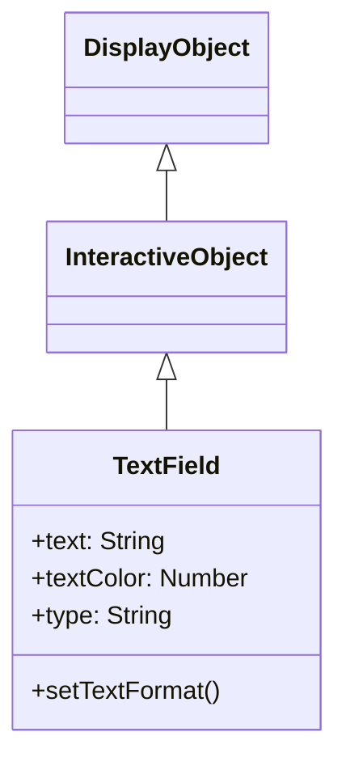

# TextField

TextField는 텍스트의 표시와 편집을 수행하는 DisplayObject입니다. 라벨 표시부터 입력 폼까지, 텍스트 관련 기능을 제공합니다.

## 상속 관계



## 프로퍼티

### 텍스트 관련

| 프로퍼티 | 타입 | 설명 |
|-----------|------|------|
| `text` | string | 텍스트 필드 내의 현재 텍스트인 문자열 |
| `htmlText` | string | 텍스트 필드의 내용을 HTML로 나타낸 문자열 |
| `length` | number | 텍스트 필드 내의 문자 수 (읽기 전용) |
| `maxChars` | number | 사용자가 입력할 수 있는 최대 문자 수 (0으로 무제한) |
| `restrict` | string | 사용자가 텍스트 필드에 입력할 수 있는 문자 집합 지정 |
| `defaultTextFormat` | TextFormat | 텍스트에 적용하는 기본 포맷 |
| `stopIndex` | number | 텍스트의 임의 표시 종료 위치 설정 (기본값: -1) |

### 표시 관련

| 프로퍼티 | 타입 | 설명 |
|-----------|------|------|
| `width` | number | 표시 오브젝트의 너비 (픽셀 단위) |
| `height` | number | 표시 오브젝트의 높이 (픽셀 단위) |
| `textWidth` | number | 텍스트의 너비 (픽셀 단위, 읽기 전용) |
| `textHeight` | number | 텍스트의 높이 (픽셀 단위, 읽기 전용) |
| `autoSize` | string | 텍스트 필드의 자동 확대/축소 및 정렬 제어 ("none", "left", "center", "right") |
| `autoFontSize` | boolean | 텍스트 크기의 자동 확대/축소 및 정렬 제어 (기본값: false) |
| `wordWrap` | boolean | 텍스트 필드의 텍스트를 줄바꿈할지 여부 (기본값: false) |
| `multiline` | boolean | 여러 줄 텍스트 필드인지 여부 (기본값: false) |
| `numLines` | number | 텍스트의 줄 수 (읽기 전용) |

### 테두리·배경 관련

| 프로퍼티 | 타입 | 설명 |
|-----------|------|------|
| `background` | boolean | 텍스트 필드에 배경 채우기가 있는지 여부 (기본값: false) |
| `backgroundColor` | number | 텍스트 필드의 배경색 (기본값: 0xffffff) |
| `border` | boolean | 텍스트 필드에 테두리가 있는지 여부 (기본값: false) |
| `borderColor` | number | 텍스트 필드의 테두리 색상 (기본값: 0x000000) |

### 윤곽 관련

| 프로퍼티 | 타입 | 설명 |
|-----------|------|------|
| `thickness` | number | 윤곽 텍스트 너비. 0 (기본값)으로 무효 |
| `thicknessColor` | number | 윤곽 텍스트의 색상 (16진수 형식, 기본값: 0) |

### 입력 관련

| 프로퍼티 | 타입 | 설명 |
|-----------|------|------|
| `type` | string | 텍스트 필드 타입 ("static", "dynamic", "input") (기본값: "static") |
| `focus` | boolean | 텍스트 필드가 포커스를 가지는지 여부 (기본값: false) |
| `focusVisible` | boolean | 텍스트 필드의 깜빡이는 선의 표시·비표시 제어 (기본값: false) |
| `focusIndex` | number | 텍스트 필드의 포커스 위치 인덱스 (기본값: -1) |
| `selectIndex` | number | 텍스트 필드의 선택 위치 인덱스 (기본값: -1) |
| `compositionStartIndex` | number | 텍스트 필드의 컴포지션 시작 인덱스 (기본값: -1) |
| `compositionEndIndex` | number | 텍스트 필드의 컴포지션 종료 인덱스 (기본값: -1) |

### 스크롤 관련

| 프로퍼티 | 타입 | 설명 |
|-----------|------|------|
| `scrollX` | number | x 축 스크롤 위치 (기본값: 0) |
| `scrollY` | number | y 축 스크롤 위치 (기본값: 0) |
| `scrollEnabled` | boolean | 스크롤 기능의 ON/OFF 제어 (기본값: true) |
| `xScrollShape` | Shape | x 스크롤바 표시용 Shape 오브젝트 (읽기 전용) |
| `yScrollShape` | Shape | y 스크롤바 표시용 Shape 오브젝트 (읽기 전용) |

## 메서드

| 메서드 | 반환값 | 설명 |
|---------|--------|------|
| `appendText(newText: string)` | void | 지정된 문자열을 텍스트 필드의 텍스트 끝에 추가합니다 |
| `insertText(newText: string)` | void | 텍스트 필드의 포커스 위치에 텍스트 추가 |
| `deleteText()` | void | 텍스트 필드의 선택 범위 삭제 |
| `getLineText(lineIndex: number)` | string | 지정된 줄의 텍스트를 반환합니다 |
| `replaceText(newText: string, beginIndex: number, endIndex: number)` | void | 지정된 문자 범위를 새 텍스트 내용으로 교체합니다 |
| `selectAll()` | void | 텍스트 필드의 모든 텍스트를 선택합니다 |
| `copy()` | void | 텍스트 필드의 선택 범위를 복사합니다 |
| `paste()` | void | 복사한 텍스트를 선택 범위에 붙여넣기합니다 |
| `setFocusIndex(stageX: number, stageY: number, selected?: boolean)` | void | 텍스트 필드의 포커스 위치를 설정합니다 |
| `keyDown(event: KeyboardEvent)` | void | 키 다운 이벤트를 처리합니다 |

## TextFormat

텍스트 스타일을 설정하는 클래스입니다.

### 프로퍼티

| 프로퍼티 | 타입 | 설명 |
|-----------|------|------|
| `font` | String | 폰트명 |
| `size` | Number | 폰트 크기 |
| `color` | Number | 텍스트 색상 |
| `bold` | Boolean | 굵게 |
| `italic` | Boolean | 기울임 |
| `align` | String | 정렬 ("left", "center", "right") |
| `leading` | Number | 줄 간격 (픽셀) |
| `letterSpacing` | Number | 문자 간격 (픽셀) |

## 사용 예제

### 기본적인 텍스트 표시

```typescript
const { TextField } = next2d.text;

const textField = new TextField();
textField.text = "Hello, Next2D!";
textField.x = 100;
textField.y = 100;

stage.addChild(textField);
```

### TextFormat 적용

```typescript
const { TextField, TextFormat } = next2d.text;

const textField = new TextField();
textField.text = "스타일이 적용된 텍스트";

// TextFormat 생성
const format = new TextFormat();
format.font = "Arial";
format.size = 24;
format.color = 0x3498db;
format.bold = true;

// 포맷 적용
textField.setTextFormat(format);

// 기본 포맷으로 설정
textField.defaultTextFormat = format;

stage.addChild(textField);
```

### 자동 크기 조정

```typescript
const { TextField } = next2d.text;

const textField = new TextField();
textField.autoSize = "left";  // 텍스트에 맞춰 자동 확장
textField.text = "이 텍스트에 맞춰 크기가 조정됩니다";

stage.addChild(textField);
```

### 여러 줄 텍스트

```typescript
const { TextField } = next2d.text;

const textField = new TextField();
textField.width = 200;
textField.multiline = true;
textField.wordWrap = true;
textField.text = "이것은 여러 줄의 텍스트입니다. 자동으로 줄바꿈됩니다.";

stage.addChild(textField);
```

### 입력 필드

```typescript
const { TextField } = next2d.text;

const inputField = new TextField();
inputField.type = "input";
inputField.width = 200;
inputField.height = 30;
inputField.border = true;
inputField.borderColor = 0xcccccc;
inputField.background = true;
inputField.backgroundColor = 0xffffff;

// 플레이스홀더 대신
inputField.text = "";

// 입력 제한 (숫자만)
inputField.restrict = "0-9";

// 입력 이벤트
inputField.addEventListener("change", (event) => {
    console.log("입력값:", inputField.text);
});

stage.addChild(inputField);
```

### 패스워드 필드

```typescript
const { TextField } = next2d.text;

const passwordField = new TextField();
passwordField.type = "input";
passwordField.displayAsPassword = true;
passwordField.width = 200;
passwordField.height = 30;
passwordField.border = true;
passwordField.borderColor = 0xcccccc;

stage.addChild(passwordField);
```

### HTML 텍스트

```typescript
const { TextField } = next2d.text;

const textField = new TextField();
textField.width = 300;
textField.multiline = true;
textField.htmlText = `
<font face="Arial" size="20" color="#3498db">
  <b>굵은 텍스트</b><br/>
  <i>기울임 텍스트</i><br/>
  <font color="#e74c3c">빨간 텍스트</font>
</font>
`;

stage.addChild(textField);
```

### 스크롤 가능한 텍스트

```typescript
const { TextField } = next2d.text;

const textField = new TextField();
textField.width = 200;
textField.height = 100;
textField.multiline = true;
textField.wordWrap = true;
textField.border = true;
textField.text = "긴 텍스트...\n".repeat(20);

// 스크롤 조작
function scrollUp() {
    if (textField.scrollY > 0) {
        textField.scrollY -= 10;
    }
}

function scrollDown() {
    textField.scrollY += 10;
}

stage.addChild(textField);
```

### 동적 텍스트 업데이트

```typescript
const { TextField, TextFormat } = next2d.text;

const scoreField = new TextField();
scoreField.autoSize = "left";

const format = new TextFormat();
format.font = "Arial";
format.size = 32;
format.color = 0xffffff;
scoreField.defaultTextFormat = format;

let score = 0;

function updateScore(points) {
    score += points;
    scoreField.text = `Score: ${score}`;
}

updateScore(0);
stage.addChild(scoreField);
```

### 텍스트 윤곽 효과

```typescript
const { TextField, TextFormat } = next2d.text;

const textField = new TextField();
textField.autoSize = "left";

const format = new TextFormat();
format.font = "Arial";
format.size = 48;
format.color = 0xffffff;
textField.defaultTextFormat = format;

textField.text = "윤곽이 있는 텍스트";
textField.thickness = 2;
textField.thicknessColor = 0x000000;

stage.addChild(textField);
```

### 텍스트 일부 교체

```typescript
const { TextField } = next2d.text;

const textField = new TextField();
textField.autoSize = "left";
textField.text = "Hello World!";

// "World"를 "Next2D"로 교체
textField.replaceText("Next2D", 6, 11);
// 결과: "Hello Next2D!"

stage.addChild(textField);
```

## 이벤트

| 이벤트 | 설명 |
|----------|------|
| `change` | 텍스트가 변경되었을 때 |
| `focus` | 포커스를 얻었을 때 |
| `blur` | 포커스를 잃었을 때 |
| `keyDown` | 키가 눌렸을 때 |
| `keyUp` | 키를 놓았을 때 |

```typescript
const { TextField } = next2d.text;

const inputField = new TextField();
inputField.type = "input";

// Enter 키로 폼 제출
inputField.addEventListener("keyDown", (event) => {
    if (event.keyCode === 13) {  // Enter
        submitForm(inputField.text);
    }
});

stage.addChild(inputField);
```

## 관련 항목

- [DisplayObject](/ja/reference/player/display-object)
- [이벤트 시스템](/ja/reference/player/events)
