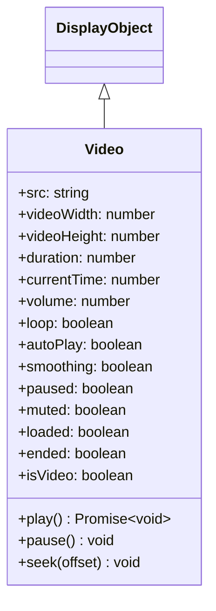

# Video

Video는 동영상 콘텐츠를 재생하기 위한 DisplayObject입니다. WebM, MP4 등의 동영상 포맷에 대응합니다.

## 상속 관계



## 프로퍼티

| 프로퍼티 | 타입 | 기본값 | 설명 |
|-----------|------|----------|------|
| `src` | string | "" | 비디오 콘텐츠로의 URL을 지정합니다 |
| `videoWidth` | number | 0 | 비디오의 너비를 픽셀 단위로 지정하는 정수입니다 |
| `videoHeight` | number | 0 | 비디오의 높이를 픽셀 단위로 지정하는 정수입니다 |
| `duration` | number | 0 | 키 프레임 총수 (동영상 길이) |
| `currentTime` | number | 0 | 현재 키 프레임 (재생 위치) |
| `volume` | number | 1 | 볼륨입니다. 범위는 0(무음)~1(풀 볼륨)입니다 |
| `loop` | boolean | false | 비디오를 루프 재생할지 여부를 지정합니다 |
| `autoPlay` | boolean | true | 비디오의 자동 재생 설정 |
| `smoothing` | boolean | true | 비디오를 확대/축소할 때 스무딩(보간)할지 여부를 지정합니다 |
| `paused` | boolean | true | 비디오가 일시정지 중인지 여부를 반환합니다 |
| `muted` | boolean | false | 비디오가 뮤트되어 있는지 여부를 반환합니다 |
| `loaded` | boolean | false | 비디오가 로드되어 있는지 여부를 반환합니다 |
| `ended` | boolean | false | 비디오가 종료되었는지 여부를 반환합니다 |
| `isVideo` | boolean | true | Video 기능을 소유하고 있는지 반환 (읽기 전용) |

## 메서드

| 메서드 | 반환값 | 설명 |
|---------|--------|------|
| `play()` | Promise\<void\> | 비디오 파일을 재생합니다 |
| `pause()` | void | 비디오 재생을 일시정지합니다 |
| `seek(offset: number)` | void | 지정된 위치에 가장 가까운 키 프레임을 시크합니다 |

## 사용 예제

### 기본적인 동영상 재생

```typescript
const { Video } = next2d.media;

// Video 오브젝트 생성 (너비, 높이 지정)
const video = new Video(640, 360);

// 동영상 URL 설정 (설정하면 자동으로 로딩 시작)
video.src = "video.mp4";

// 프로퍼티 설정
video.autoPlay = true;   // 자동 재생
video.loop = false;      // 루프 안 함
video.smoothing = true;  // 스무딩 활성화

// 스테이지에 추가
stage.addChild(video);
```

### 재생 컨트롤

```typescript
const { Video, VideoEvent } = next2d.media;

const video = new Video(640, 360);
video.autoPlay = false;  // 자동 재생 비활성화
video.src = "video.mp4";

stage.addChild(video);

// 재생 버튼
playButton.addEventListener("click", async () => {
    await video.play();
});

// 일시정지 버튼
pauseButton.addEventListener("click", () => {
    video.pause();
});

// 정지 버튼 (처음으로 돌아가서 정지)
stopButton.addEventListener("click", () => {
    video.pause();
    video.seek(0);
});

// 10초 진행
forwardButton.addEventListener("click", () => {
    video.seek(video.currentTime + 10);
});

// 10초 뒤로
backButton.addEventListener("click", () => {
    video.seek(Math.max(0, video.currentTime - 10));
});
```

### 이벤트 리스닝

```typescript
const { Video, VideoEvent } = next2d.media;

const video = new Video(640, 360);

// 메타데이터 수신 이벤트
video.addEventListener(VideoEvent.METADATA_RECEIVED, () => {
    console.log("Duration:", video.duration);
    console.log("Size:", video.videoWidth, "x", video.videoHeight);
});

// 재생 이벤트
video.addEventListener(VideoEvent.PLAY, () => {
    console.log("재생 시작");
});

// 일시정지 이벤트
video.addEventListener(VideoEvent.PAUSE, () => {
    console.log("일시정지");
});

// 시크 이벤트
video.addEventListener(VideoEvent.SEEK, () => {
    console.log("시크:", video.currentTime);
});

// 종료 이벤트
video.addEventListener(VideoEvent.ENDED, () => {
    console.log("재생 종료");
});

video.src = "video.mp4";
stage.addChild(video);
```

### 재생 진행 표시

```typescript
const { Video, VideoEvent } = next2d.media;

const video = new Video(640, 360);
video.src = "video.mp4";
stage.addChild(video);

// 프레임마다 진행 업데이트
stage.addEventListener("enterFrame", () => {
    if (video.duration > 0) {
        const progress = video.currentTime / video.duration;
        progressBar.scaleX = progress;
        timeLabel.text = formatTime(video.currentTime) + " / " + formatTime(video.duration);
    }
});

function formatTime(seconds) {
    const min = Math.floor(seconds / 60);
    const sec = Math.floor(seconds % 60);
    return `${min}:${sec.toString().padStart(2, '0')}`;
}
```

### 음량 컨트롤

```typescript
const { Video } = next2d.media;

const video = new Video(640, 360);
video.src = "video.mp4";
video.volume = 0.5;  // 50%

stage.addChild(video);

// 음량 슬라이더
volumeSlider.addEventListener("change", (event) => {
    video.volume = event.target.value;  // 0.0 ~ 1.0
});

// 뮤트 토글
muteButton.addEventListener("click", () => {
    video.muted = !video.muted;
});
```

### 루프 재생

```typescript
const { Video } = next2d.media;

const video = new Video(640, 360);
video.loop = true;  // 루프 활성화
video.src = "video.mp4";

stage.addChild(video);
```

## VideoEvent

| 이벤트 | 설명 |
|----------|------|
| `VideoEvent.METADATA_RECEIVED` | 메타데이터 수신 시 |
| `VideoEvent.PLAY` | 재생 시작 시 |
| `VideoEvent.PAUSE` | 일시정지 시 |
| `VideoEvent.SEEK` | 시크 시 |
| `VideoEvent.ENDED` | 재생 종료 시 |

## 지원 포맷

| 포맷 | 확��자 | 대응 상황 |
|--------------|--------|----------|
| MP4 (H.264) | .mp4 | 권장 |
| WebM (VP8/VP9) | .webm | 대응 |
| Ogg Theora | .ogv | 브라우저 의존 |

## 관련 항목

- [DisplayObject](/ja/reference/player/display-object)
- [이벤트 시스템](/ja/reference/player/events)
